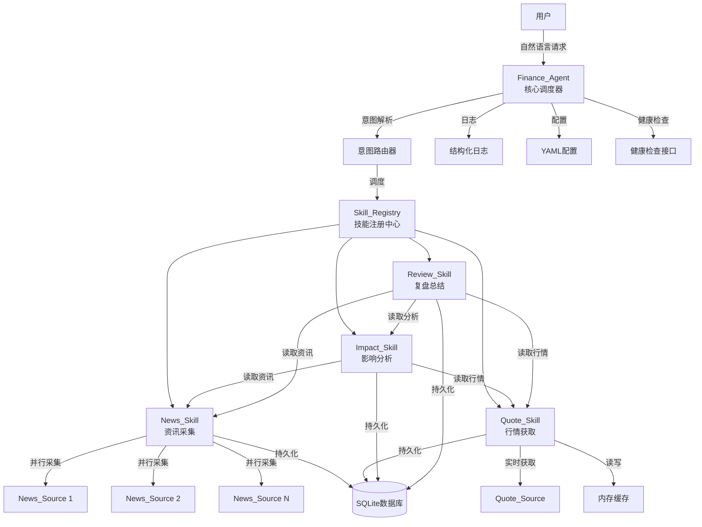
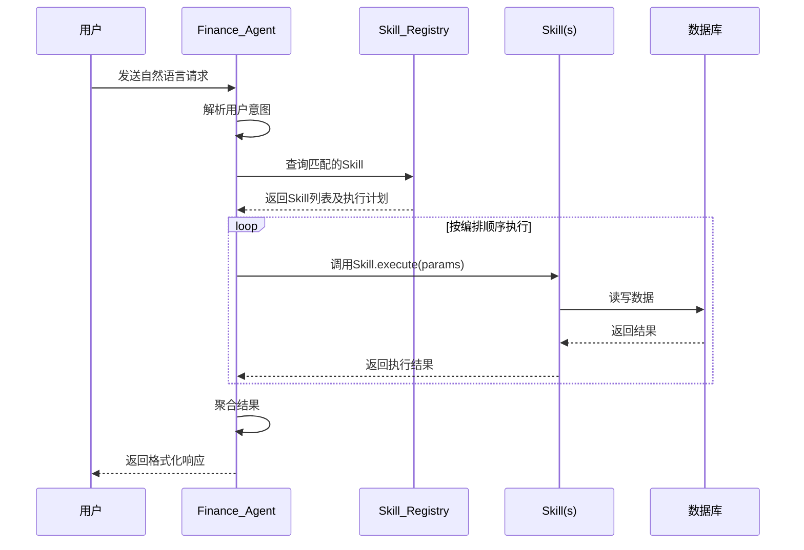

# 设计文档：财经智能Agent系统

## 概述

本设计文档描述财经智能Agent系统的技术架构和实现方案。系统采用Agent + Skill插件化架构，以Finance_Agent为核心调度器，通过Skill_Registry管理和编排多个独立的Skill模块（News_Skill、Quote_Skill、Impact_Skill、Review_Skill），实现财经资讯采集、A股行情获取、影响分析和市场复盘等功能。

系统基于Python实现，使用YAML进行配置管理，SQLite作为持久化存储，内存缓存用于行情数据的高频访问场景。

### 设计目标

- 插件化：Skill模块独立开发、注册、热插拔，核心调度代码无需修改
- 可编排：支持单次请求中多Skill串行/并行协同执行
- 高实时性：行情数据支持秒级刷新，资讯采集支持多源并行
- 可靠性：数据源故障自动降级，错误信息明确可追溯
- 可维护：结构化日志、健康检查、YAML配置

## 架构

### 整体架构图



### 请求处理流程



### 关键设计决策

| 决策 | 选择 | 理由 |
|------|------|------|
| 编程语言 | Python 3.8+ | 项目已有Python基础设施，生态丰富 |
| 数据库 | SQLite | 轻量级，无需额外部署，适合单机场景 |
| 缓存 | 内存字典 + TTL | 行情数据高频访问，无需分布式缓存 |
| 配置格式 | YAML | 项目已使用PyYAML，可读性好 |
| 并行采集 | asyncio | Python原生异步，适合IO密集型任务 |
| 测试框架 | pytest + hypothesis | 项目已配置，支持属性测试 |


## 组件与接口

### 1. Finance_Agent（核心调度器）

```python
class FinanceAgent:
    """财经智能Agent核心调度器"""
    
    def __init__(self, config: AgentConfig):
        """初始化Agent，加载配置并注册Skill"""
    
    async def handle_request(self, user_input: str) -> AgentResponse:
        """处理用户自然语言请求，解析意图并调度Skill执行"""
    
    def parse_intent(self, user_input: str) -> Intent:
        """解析用户输入，识别意图和参数"""
    
    async def execute_plan(self, plan: ExecutionPlan) -> List[SkillResult]:
        """按编排计划执行多个Skill"""
    
    def health_check(self) -> HealthStatus:
        """返回系统健康状态"""
```

### 2. Skill_Registry（技能注册中心）

```python
class SkillRegistry:
    """技能注册中心，管理所有Skill的注册和查找"""
    
    def register(self, skill: BaseSkill) -> None:
        """注册新Skill，存储其元信息"""
    
    def unregister(self, skill_name: str) -> None:
        """注销Skill"""
    
    def get_skill(self, skill_name: str) -> Optional[BaseSkill]:
        """按名称获取Skill"""
    
    def list_skills(self) -> List[SkillInfo]:
        """列出所有已注册Skill的元信息"""
    
    def resolve_skills(self, intent: Intent) -> ExecutionPlan:
        """根据意图解析需要执行的Skill及其执行顺序"""
```

### 3. BaseSkill（Skill基类）

```python
class BaseSkill(ABC):
    """所有Skill的抽象基类"""
    
    @property
    @abstractmethod
    def name(self) -> str:
        """Skill名称"""
    
    @property
    @abstractmethod
    def description(self) -> str:
        """Skill描述"""
    
    @property
    @abstractmethod
    def input_schema(self) -> Dict[str, Any]:
        """输入参数Schema"""
    
    @property
    @abstractmethod
    def output_schema(self) -> Dict[str, Any]:
        """输出格式Schema"""
    
    @abstractmethod
    async def execute(self, params: Dict[str, Any]) -> SkillResult:
        """执行Skill任务"""
    
    @abstractmethod
    def validate_params(self, params: Dict[str, Any]) -> ValidationResult:
        """验证输入参数"""
```

### 4. News_Skill（资讯采集技能）

```python
class NewsSkill(BaseSkill):
    """资讯采集技能"""
    
    async def execute(self, params: Dict[str, Any]) -> SkillResult:
        """执行资讯采集或查询任务"""
    
    async def fetch_all_sources(self) -> List[NewsItem]:
        """从所有已配置数据源并行采集资讯"""
    
    async def fetch_from_source(self, source: NewsSource) -> List[NewsItem]:
        """从单个数据源采集资讯"""
    
    def extract_keywords(self, news_item: NewsItem) -> List[str]:
        """从资讯中提取关键词标签"""
    
    def deduplicate(self, items: List[NewsItem]) -> List[NewsItem]:
        """去除重复资讯"""
    
    def query_news(self, filters: NewsFilter) -> List[NewsItem]:
        """按条件筛选查询资讯"""
    
    def parse_json(self, raw_data: str) -> NewsItem:
        """解析JSON格式资讯数据"""
    
    def parse_html(self, raw_data: str) -> NewsItem:
        """解析HTML格式资讯数据"""
    
    def format_news_item(self, item: NewsItem) -> str:
        """将NewsItem格式化为可读文本"""
    
    def parse_formatted_text(self, text: str) -> NewsItem:
        """从格式化文本解析回NewsItem"""
```

### 5. Quote_Skill（行情获取技能）

```python
class QuoteSkill(BaseSkill):
    """行情获取技能"""
    
    async def execute(self, params: Dict[str, Any]) -> SkillResult:
        """执行行情获取任务"""
    
    async def fetch_all_quotes(self) -> List[StockQuote]:
        """获取全市场行情数据"""
    
    def filter_quotes(self, quotes: List[StockQuote], filters: QuoteFilter) -> List[StockQuote]:
        """按条件筛选行情数据"""
    
    def get_ranking(self, ranking_type: RankingType, top_n: int = 50) -> List[StockQuote]:
        """获取排行榜数据"""
    
    def get_cached_quotes(self) -> Optional[List[StockQuote]]:
        """获取缓存中的行情数据"""
    
    def update_cache(self, quotes: List[StockQuote]) -> None:
        """更新行情缓存"""
    
    def is_cache_expired(self) -> bool:
        """检查缓存是否过期"""
    
    def is_trading_hours(self) -> bool:
        """判断当前是否为交易时段"""
```

### 6. Impact_Skill（影响分析技能）

```python
class ImpactSkill(BaseSkill):
    """影响分析技能"""
    
    async def execute(self, params: Dict[str, Any]) -> SkillResult:
        """执行影响分析任务"""
    
    def analyze_impact(self, news_item: NewsItem, quotes: List[StockQuote]) -> ImpactReport:
        """分析资讯对股票的影响"""
    
    def match_stocks(self, keywords: List[str], quotes: List[StockQuote]) -> List[StockQuote]:
        """通过关键词匹配关联股票"""
    
    def query_reports(self, filters: ImpactFilter) -> List[ImpactReport]:
        """按条件查询历史影响分析报告"""
```

### 7. Review_Skill（复盘总结技能）

```python
class ReviewSkill(BaseSkill):
    """复盘总结技能"""
    
    async def execute(self, params: Dict[str, Any]) -> SkillResult:
        """执行复盘总结任务"""
    
    def generate_daily_review(self, date: str) -> ReviewReport:
        """生成日度复盘报告"""
    
    def generate_weekly_review(self, start_date: str, end_date: str) -> ReviewReport:
        """生成周度复盘报告"""
    
    def generate_monthly_review(self, year: int, month: int) -> ReviewReport:
        """生成月度复盘报告"""
    
    def export_markdown(self, report: ReviewReport) -> str:
        """将复盘报告导出为Markdown格式"""
```


## 数据模型

### 核心数据对象

```python
@dataclass
class NewsItem:
    """单条资讯对象"""
    id: str                          # 唯一标识
    title: str                       # 标题
    summary: str                     # 内容摘要
    source_name: str                 # 来源名称
    published_at: datetime           # 发布时间
    url: str                         # 原文链接
    keywords: List[str]              # 关键词标签（行业、公司、政策等）
    news_type: NewsType              # 资讯类型（新闻/公告/研报）
    raw_content: str                 # 原始内容
    created_at: datetime             # 采集时间

class NewsType(Enum):
    NEWS = "news"           # 新闻
    ANNOUNCEMENT = "announcement"  # 公告
    REPORT = "report"       # 研报

@dataclass
class StockQuote:
    """单只股票行情对象"""
    code: str               # 股票代码
    name: str               # 股票名称
    current_price: float    # 当前价格
    open_price: float       # 开盘价
    high_price: float       # 最高价
    low_price: float        # 最低价
    change_amount: float    # 涨跌额
    change_percent: float   # 涨跌幅（百分比）
    volume: int             # 成交量（股）
    turnover: float         # 成交额（元）
    board: BoardType        # 板块
    timestamp: datetime     # 数据时间戳

class BoardType(Enum):
    MAIN = "main"           # 主板
    GEM = "gem"             # 创业板
    STAR = "star"           # 科创板
    BSE = "bse"             # 北交所

@dataclass
class ImpactReport:
    """影响分析报告"""
    id: str                              # 唯一标识
    news_item_id: str                    # 触发资讯ID
    affected_stocks: List[AffectedStock] # 受影响股票列表
    created_at: datetime                 # 生成时间

@dataclass
class AffectedStock:
    """受影响的股票"""
    stock_code: str                      # 股票代码
    stock_name: str                      # 股票名称
    direction: ImpactDirection           # 影响方向
    severity: ImpactSeverity             # 影响程度
    reasoning: str                       # 分析依据
    current_quote: StockQuote            # 当前行情快照

class ImpactDirection(Enum):
    POSITIVE = "positive"    # 利好
    NEGATIVE = "negative"    # 利空
    NEUTRAL = "neutral"      # 中性

class ImpactSeverity(Enum):
    HIGH = "high"            # 高
    MEDIUM = "medium"        # 中
    LOW = "low"              # 低

@dataclass
class ReviewReport:
    """复盘总结报告"""
    id: str                              # 唯一标识
    report_type: ReviewType              # 报告类型
    start_date: str                      # 起始日期
    end_date: str                        # 结束日期
    market_indices: List[IndexPerformance]  # 大盘指数表现
    sector_rankings: List[SectorRanking]    # 板块涨跌排名
    limit_up_count: int                  # 涨停股票数
    limit_down_count: int                # 跌停股票数
    turnover_comparison: TurnoverComparison  # 成交额对比
    hot_events: List[str]                # 热点事件总结
    sentiment: MarketSentiment           # 市场情绪分析
    trend_summary: str                   # 趋势总结
    created_at: datetime                 # 生成时间

class ReviewType(Enum):
    DAILY = "daily"
    WEEKLY = "weekly"
    MONTHLY = "monthly"

@dataclass
class IndexPerformance:
    """指数表现"""
    name: str               # 指数名称（上证指数/深证成指/创业板指）
    close_price: float      # 收盘价
    change_percent: float   # 涨跌幅

@dataclass
class SectorRanking:
    """板块排名"""
    sector_name: str        # 板块名称
    change_percent: float   # 涨跌幅
    rank: int               # 排名

@dataclass
class TurnoverComparison:
    """成交额对比"""
    current: float          # 当日成交额
    previous: float         # 前一交易日成交额
    change_percent: float   # 变化百分比

@dataclass
class MarketSentiment:
    """市场情绪"""
    advance_decline_ratio: float   # 涨跌家数比
    limit_up_down_ratio: float     # 涨停跌停比
    volume_change: float           # 成交量变化
    sentiment_label: str           # 情绪标签（乐观/谨慎/悲观）
```

### 配置数据模型

```python
@dataclass
class AgentConfig:
    """Agent配置"""
    skills: Dict[str, SkillConfig]     # 各Skill配置
    log_level: str                      # 日志级别
    database_path: str                  # 数据库路径

@dataclass
class SkillConfig:
    """Skill配置"""
    enabled: bool                       # 是否启用
    sources: List[SourceConfig]         # 数据源配置
    fetch_interval: int                 # 采集频率（秒）
    cache_ttl: int                      # 缓存过期时间（秒）

@dataclass
class SourceConfig:
    """数据源配置"""
    name: str                           # 数据源名称
    url: str                            # 接口地址
    auth_token: Optional[str]           # 认证令牌
    timeout: int                        # 超时时间（秒）

@dataclass
class NewsSource:
    """资讯数据源运行时状态"""
    config: SourceConfig                # 配置信息
    is_available: bool                  # 是否可用
    consecutive_failures: int           # 连续失败次数
```

### YAML配置文件示例

```yaml
agent:
  log_level: INFO
  database_path: ./data/finance_agent.db

skills:
  news:
    enabled: true
    fetch_interval: 60
    sources:
      - name: "财经资讯源A"
        url: "https://api.example.com/news"
        auth_token: "${NEWS_SOURCE_A_TOKEN}"
        timeout: 10
      - name: "财经资讯源B"
        url: "https://api.example.com/news2"
        auth_token: "${NEWS_SOURCE_B_TOKEN}"
        timeout: 10
      - name: "财经资讯源C"
        url: "https://api.example.com/news3"
        auth_token: null
        timeout: 15

  quote:
    enabled: true
    fetch_interval: 5
    cache_ttl: 10
    sources:
      - name: "行情数据源"
        url: "https://api.example.com/quotes"
        auth_token: "${QUOTE_SOURCE_TOKEN}"
        timeout: 30

  impact:
    enabled: true

  review:
    enabled: true
```

### 数据库Schema

```sql
-- 资讯表
CREATE TABLE news_items (
    id TEXT PRIMARY KEY,
    title TEXT NOT NULL,
    summary TEXT,
    source_name TEXT NOT NULL,
    published_at TIMESTAMP NOT NULL,
    url TEXT,
    keywords TEXT,  -- JSON数组
    news_type TEXT NOT NULL,
    raw_content TEXT,
    created_at TIMESTAMP DEFAULT CURRENT_TIMESTAMP
);

-- 行情快照表
CREATE TABLE stock_quotes (
    id INTEGER PRIMARY KEY AUTOINCREMENT,
    code TEXT NOT NULL,
    name TEXT NOT NULL,
    current_price REAL,
    open_price REAL,
    high_price REAL,
    low_price REAL,
    change_amount REAL,
    change_percent REAL,
    volume INTEGER,
    turnover REAL,
    board TEXT,
    timestamp TIMESTAMP NOT NULL,
    snapshot_date TEXT NOT NULL  -- 交易日期，用于收盘快照
);

-- 影响分析报告表
CREATE TABLE impact_reports (
    id TEXT PRIMARY KEY,
    news_item_id TEXT NOT NULL,
    affected_stocks TEXT NOT NULL,  -- JSON数组
    created_at TIMESTAMP DEFAULT CURRENT_TIMESTAMP,
    FOREIGN KEY (news_item_id) REFERENCES news_items(id)
);

-- 复盘报告表
CREATE TABLE review_reports (
    id TEXT PRIMARY KEY,
    report_type TEXT NOT NULL,
    start_date TEXT NOT NULL,
    end_date TEXT NOT NULL,
    content TEXT NOT NULL,  -- JSON格式的完整报告内容
    created_at TIMESTAMP DEFAULT CURRENT_TIMESTAMP
);

-- 索引
CREATE INDEX idx_news_published_at ON news_items(published_at);
CREATE INDEX idx_news_type ON news_items(news_type);
CREATE INDEX idx_quotes_code_date ON stock_quotes(code, snapshot_date);
CREATE INDEX idx_quotes_snapshot_date ON stock_quotes(snapshot_date);
CREATE INDEX idx_impact_news_id ON impact_reports(news_item_id);
CREATE INDEX idx_review_type_date ON review_reports(report_type, start_date);
```


## 正确性属性

*正确性属性是指在系统所有有效执行中都应成立的特征或行为——本质上是关于系统应该做什么的形式化陈述。属性是连接人类可读规范和机器可验证正确性保证之间的桥梁。*

### Property 1: 意图解析正确调度Skill

*对于任意*已知意图类型的用户请求，Finance_Agent解析意图后应该调度到正确的Skill执行，且返回的Skill名称与意图类型匹配。

**Validates: Requirements 1.2**

### Property 2: 新Skill注册后可被发现和调用

*对于任意*新创建的BaseSkill实现，注册到Skill_Registry后，Agent应该能够通过Registry发现该Skill并成功调用其execute方法。

**Validates: Requirements 1.4**

### Property 3: 多Skill编排执行完整性

*对于任意*包含多个Skill的执行计划，Finance_Agent应该按计划顺序执行所有Skill，且最终结果包含每个Skill的执行结果。

**Validates: Requirements 1.5**

### Property 4: Skill失败错误信息完整性

*对于任意*Skill执行失败的场景，Finance_Agent返回的错误信息应该包含失败的Skill名称和具体的错误原因描述。

**Validates: Requirements 1.6**

### Property 5: 多源并行采集覆盖所有数据源

*对于任意*数量的已配置News_Source，触发采集任务后，每个可用的数据源都应该被调用一次。

**Validates: Requirements 2.2**

### Property 6: 采集资讯字段完整性

*对于任意*采集到的News_Item，其标题、内容摘要、来源名称、发布时间和原文链接字段都应该非空。

**Validates: Requirements 2.3**

### Property 7: 资讯关键词自动提取

*对于任意*包含行业、公司名称或政策类型信息的News_Item，提取的关键词标签列表应该非空。

**Validates: Requirements 2.4**

### Property 8: 资讯去重与排序

*对于任意*资讯列表，经过去重和排序处理后，结果列表中不应包含重复项（基于标题和来源判断），且按发布时间倒序排列。

**Validates: Requirements 2.5**

### Property 9: 资讯筛选结果一致性

*对于任意*筛选条件（关键词、时间范围、资讯类型），返回的所有News_Item都应该满足该筛选条件。

**Validates: Requirements 2.7**

### Property 10: Stock_Quote字段完整性

*对于任意*返回的StockQuote对象，股票代码、名称、当前价格、涨跌幅等所有必填字段都应该存在且数值有效（价格非负，代码格式正确）。

**Validates: Requirements 3.2**

### Property 11: 行情筛选结果一致性

*对于任意*筛选条件（股票代码、名称或板块），返回的所有StockQuote都应该满足该筛选条件。

**Validates: Requirements 3.4**

### Property 12: 排行榜正确排序与长度限制

*对于任意*行情数据集和排行类型（涨幅/跌幅/成交额），返回的排行榜应该按对应指标正确排序，且长度不超过50。

**Validates: Requirements 3.5**

### Property 13: 影响分析报告完整性

*对于任意*生成的ImpactReport，应该包含受影响的股票列表、每只股票的影响方向和程度、分析依据文本，以及触发分析的NewsItem引用和关联股票的当前StockQuote快照。

**Validates: Requirements 4.2, 4.4**

### Property 14: 关键词与股票关联匹配正确性

*对于任意*资讯关键词列表和行情数据集，匹配结果中的每只股票的名称或所属行业应该与至少一个关键词存在关联。

**Validates: Requirements 4.3**

### Property 15: 影响报告筛选结果一致性

*对于任意*筛选条件（影响方向和影响程度），返回的所有ImpactReport中的受影响股票都应该满足该筛选条件。

**Validates: Requirements 4.5**

### Property 16: 复盘报告内容完整性

*对于任意*生成的ReviewReport，应该包含以下所有内容板块：大盘指数表现、板块涨跌排名、涨跌停统计、成交额对比、热点事件总结、市场情绪分析和趋势总结。

**Validates: Requirements 5.2, 5.3, 5.4, 5.7**

### Property 17: 周度/月度复盘报告时间跨度正确性

*对于任意*有效的时间跨度请求（周度或月度），生成的ReviewReport的起止日期应该覆盖请求的完整时间范围。

**Validates: Requirements 5.5**

### Property 18: 复盘报告Markdown导出完整性

*对于任意*ReviewReport，导出的Markdown文本应该包含报告中所有关键信息（指数表现、板块排名、涨跌停统计等）。

**Validates: Requirements 5.6**

### Property 19: 数据对象持久化往返一致性

*对于任意*有效的数据对象（NewsItem、StockQuote、ImpactReport、ReviewReport），存储到数据库后再查询读取，应该产生与原始对象等价的结果。

**Validates: Requirements 6.1, 6.2, 6.3, 6.4**

### Property 20: 行情缓存读写一致性

*对于任意*行情数据列表，更新缓存后立即读取，应该返回与写入数据相同的结果。

**Validates: Requirements 6.6**

### Property 21: YAML配置解析往返一致性

*对于任意*有效的AgentConfig对象，序列化为YAML后再解析，应该产生等价的AgentConfig对象。

**Validates: Requirements 7.1**

### Property 22: 结构化日志完整性

*对于任意*Skill调用，生成的结构化日志应该包含输入参数、执行耗时和返回状态三个字段。

**Validates: Requirements 7.2**

### Property 23: 健康检查覆盖所有组件

*对于任意*系统状态，健康检查返回的结果应该包含所有已注册Skill的运行状态和所有已配置数据源的连接状态。

**Validates: Requirements 7.5**

### Property 24: 资讯数据解析有效性

*对于任意*有效的JSON或HTML格式资讯数据，解析后应该产生字段完整的NewsItem对象。

**Validates: Requirements 8.1**

### Property 25: NewsItem格式化往返一致性

*对于任意*有效的NewsItem对象，格式化为文本后再解析回NewsItem，应该产生与原始对象等价的结果。

**Validates: Requirements 8.3**

### Property 26: 解析错误信息描述性

*对于任意*格式不正确的资讯数据输入，解析返回的错误信息应该包含错误位置和错误原因的描述。

**Validates: Requirements 8.4**


## 错误处理

### 错误处理策略

系统采用Result类型进行错误处理，避免使用异常进行流程控制。所有Skill的execute方法返回`Result[SkillResult, SkillError]`。

### 错误分类

| 错误类别 | 处理方式 | 示例 |
|----------|----------|------|
| 数据源不可用 | 降级处理，跳过该数据源，使用其他可用数据源 | News_Source连接超时 |
| 数据格式异常 | 跳过异常数据，记录错误日志，继续处理其余数据 | Quote_Source返回非法JSON |
| Skill执行失败 | 向用户返回包含Skill名称和错误原因的错误信息 | Impact_Skill分析超时 |
| 配置错误 | 启动时输出明确错误信息并终止 | YAML格式不正确 |
| 数据库错误 | 记录错误日志，返回错误结果 | SQLite写入失败 |
| 缓存未命中 | 自动从数据源重新获取数据 | 行情缓存过期 |

### 数据源故障降级

```python
class SourceHealthTracker:
    """数据源健康状态追踪"""
    
    def record_failure(self, source_name: str) -> None:
        """记录一次失败，连续3次失败后标记为不可用"""
    
    def record_success(self, source_name: str) -> None:
        """记录一次成功，重置失败计数"""
    
    def is_available(self, source_name: str) -> bool:
        """检查数据源是否可用"""
```

### 错误信息格式

```python
@dataclass
class SkillError:
    """Skill执行错误"""
    skill_name: str          # 失败的Skill名称
    error_code: str          # 错误代码
    message: str             # 错误描述
    details: Optional[Dict]  # 详细信息（如错误位置、原始异常等）
    timestamp: datetime      # 错误发生时间
```

### 解析错误信息

```python
@dataclass
class ParseError:
    """解析错误"""
    position: int            # 错误位置（字符偏移量）
    line: Optional[int]      # 错误行号
    column: Optional[int]    # 错误列号
    reason: str              # 错误原因描述
    raw_snippet: str         # 错误位置附近的原始数据片段
```

## 测试策略

### 测试框架

- **单元测试**: pytest
- **属性测试**: hypothesis（Python属性测试库）
- 两者互补：单元测试验证具体示例和边界情况，属性测试验证通用属性

### 属性测试配置

- 每个属性测试最少运行100次迭代
- 每个属性测试必须通过注释引用设计文档中的属性编号
- 标签格式: `Feature: financial-intelligence-agent, Property {number}: {property_text}`

### 单元测试范围

单元测试聚焦于以下场景：

1. **具体示例**
   - 解析已知格式的JSON资讯数据
   - 解析已知格式的HTML资讯数据
   - 从至少3个数据源采集资讯（需求2.1）
   - 缓存过期后标记为过期状态（需求6.7）
   - 日志级别配置生效（需求7.4）

2. **边界情况**
   - 数据源连续3次失败后标记为不可用（需求2.6）
   - Quote_Source返回异常数据时跳过并继续处理（需求3.6）
   - 资讯无法关联任何股票时标记为"无直接关联"（需求4.6）
   - 配置文件格式不正确时输出错误信息并终止（需求7.3）

3. **集成测试**
   - Agent接收请求 → 解析意图 → 调度Skill → 返回结果的完整流程
   - 多Skill编排执行的端到端流程

### 属性测试范围

每个正确性属性对应一个属性测试，使用hypothesis生成随机输入：

| 属性编号 | 测试描述 | 生成器策略 |
|----------|----------|------------|
| Property 1 | 意图解析正确调度 | 生成随机意图类型和用户请求文本 |
| Property 2 | 新Skill注册可发现 | 生成随机Skill元信息 |
| Property 3 | 多Skill编排完整性 | 生成随机执行计划（1-5个Skill） |
| Property 4 | 失败错误信息完整 | 生成随机Skill名称和错误类型 |
| Property 5 | 多源并行采集覆盖 | 生成随机数量的数据源配置 |
| Property 6 | NewsItem字段完整 | 生成随机NewsItem数据 |
| Property 7 | 关键词自动提取 | 生成包含行业/公司信息的随机文本 |
| Property 8 | 去重与排序 | 生成包含重复项的随机资讯列表 |
| Property 9 | 资讯筛选一致性 | 生成随机筛选条件和资讯数据集 |
| Property 10 | StockQuote字段完整 | 生成随机StockQuote数据 |
| Property 11 | 行情筛选一致性 | 生成随机筛选条件和行情数据集 |
| Property 12 | 排行榜排序与限制 | 生成随机行情数据集（0-200条） |
| Property 13 | ImpactReport完整性 | 生成随机影响分析报告 |
| Property 14 | 关键词股票匹配 | 生成随机关键词和行情数据 |
| Property 15 | 影响报告筛选一致性 | 生成随机筛选条件和报告数据集 |
| Property 16 | ReviewReport内容完整 | 生成随机复盘报告数据 |
| Property 17 | 时间跨度正确性 | 生成随机周度/月度时间范围 |
| Property 18 | Markdown导出完整 | 生成随机ReviewReport |
| Property 19 | 数据持久化往返 | 生成随机数据对象，存储后读取比较 |
| Property 20 | 缓存读写一致性 | 生成随机行情数据列表 |
| Property 21 | YAML配置往返 | 生成随机AgentConfig对象 |
| Property 22 | 日志完整性 | 生成随机Skill调用参数和结果 |
| Property 23 | 健康检查覆盖 | 生成随机数量的Skill和数据源 |
| Property 24 | 资讯解析有效性 | 生成随机有效JSON/HTML资讯数据 |
| Property 25 | NewsItem格式化往返 | 生成随机有效NewsItem对象 |
| Property 26 | 解析错误描述性 | 生成随机格式不正确的输入数据 |

### 测试文件组织

```
tests/
├── test_agent.py              # Finance_Agent单元测试和属性测试
├── test_skill_registry.py     # Skill_Registry单元测试和属性测试
├── test_news_skill.py         # News_Skill单元测试和属性测试
├── test_quote_skill.py        # Quote_Skill单元测试和属性测试
├── test_impact_skill.py       # Impact_Skill单元测试和属性测试
├── test_review_skill.py       # Review_Skill单元测试和属性测试
├── test_data_storage.py       # 数据持久化往返测试
├── test_news_parser.py        # 资讯解析和格式化往返测试
├── test_config.py             # 配置解析测试
└── conftest.py                # 共享fixtures和hypothesis策略
```
